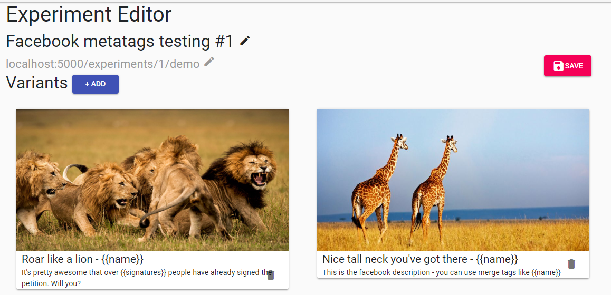
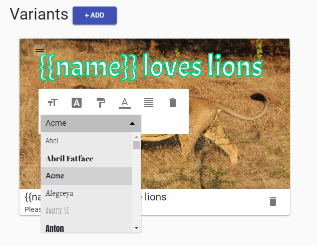

# Facebook Share Tester

This allows you to test multiple variants of title, description and image of the share preview on Facebook. It uses a [bandit algorithm](https://en.wikipedia.org/wiki/Thompson_sampling) to find the best variant much more quickly than conventional A/B testing.

You add overlay text to the image, and personalise the title, description and image text with merge tags.

# Try it out - deploy a working version of the app to Heroku now

Required ENV variables:
 - APP_URL - this needs to be set to https://your-app-name.herokuapp.com (no trailing slash)

## Dev Setup

The app uses Ruby on Rails with React / Redux for the front end (in order to achieve as many 'R's as possible).

Dependencies:
 - Ruby
 - Postgres
 - Redis
 - Node
 - Yarn (Node package management)

Once you have these setup you can run the following to set the app up locally.

`git clone https://github.com/jamesr2323/facebook_share_tester.git`
`cd facebook_share_tester`
`bundle install`
`createdb facebook_share_tester_dev`

Add the connection string for the local database to a .env file in the app root directory. `DATABASE_URL=.....`

`foreman run rake db:schema:load`
`foreman start -f Procfile.dev`

## ENV variables
 - GOOGLE_CLIENT_ID - Used for OAuth login, get it from the Google Cloud console
 - GOOGLE_CLIENT_SECRET

## Tests

Coming soon!
